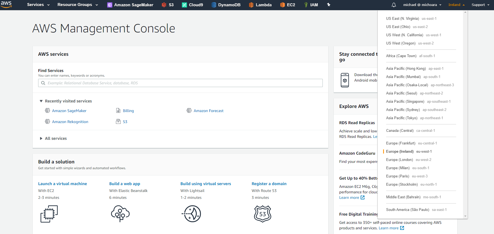
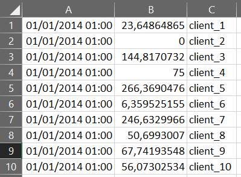
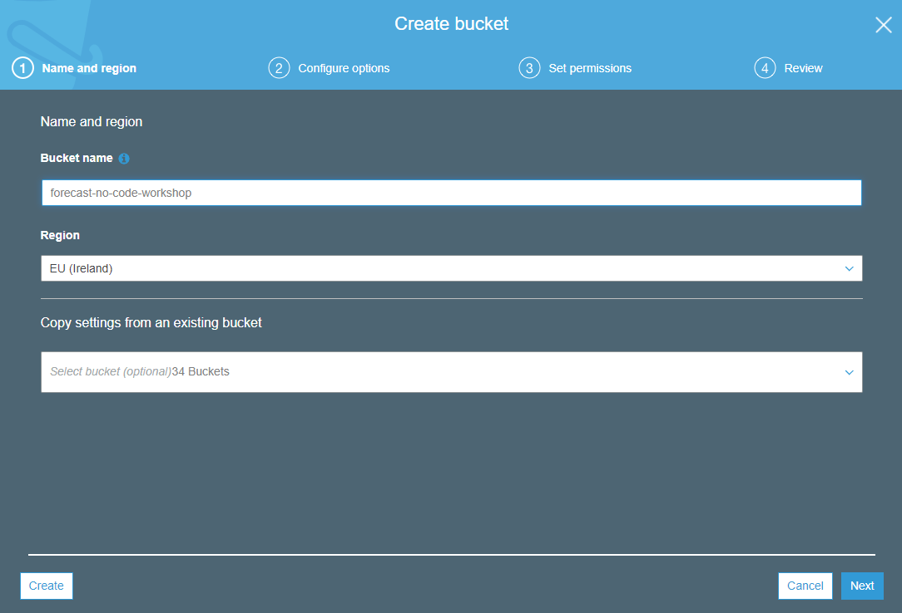
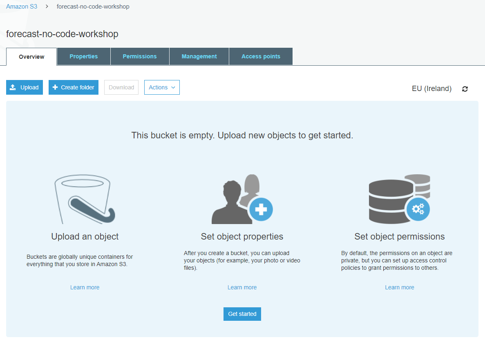
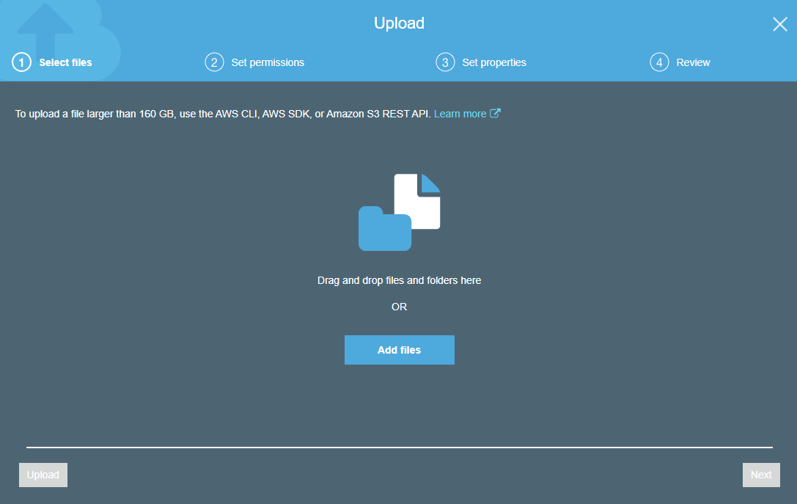
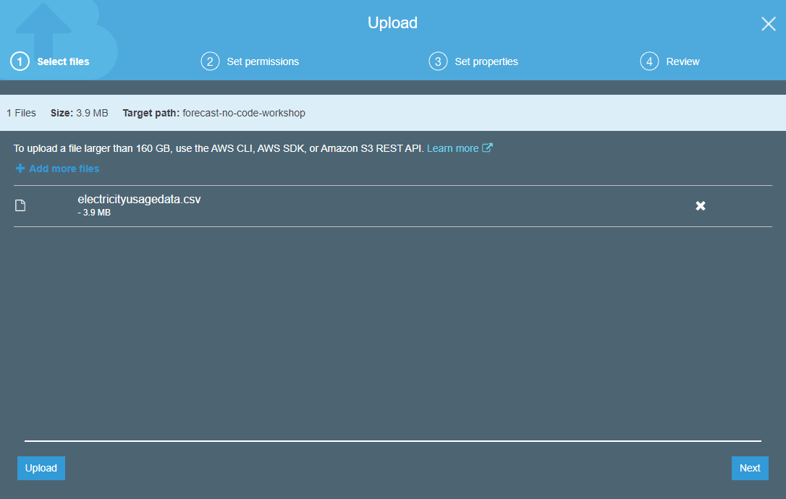
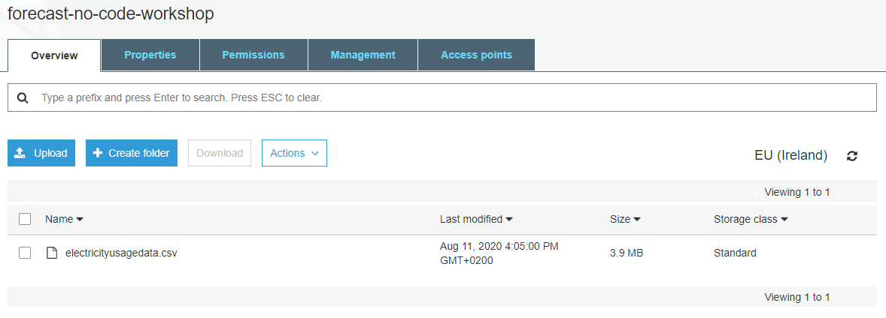

# Amazon Forecast No-code-workshop
*No code workshop to experiment on Amazon Forecast*

Introduction: Amazon Forecast is a machine learning service that provides prediction based on time series data provided by AWS.

## Region selection
Please check with your instructor about the regions where you will be working for this hands-on. You can change it by selecting the region name in the upper right of the screen:


 
## Download data for learning
[This CSV file](data/electricityusagedata.csv) includes power consumption data for individual households. Here's a snippet of this file:
 


In this hands-on workshop, future power consumption will be predicted based on this time series data. Amazon Forecast can process any time series data, so sales data, inventory consumption data, etc. can also be used.

## Creating an S3 bucket
Amazon Forecast imports the training data from any S3 bucket: let's create one to store the CSV file downloaded earlier.

1. Access the S3 management console by typing S3 as shown below:


 
2. Press [Create Bucket]


3. Enter an appropriate name in [Bucket Name]

The S3 bucket must have a reasonably long name because it must be unique across all AWS users. Specify the same region as the region in which you will be working on Amazon Forecast.



Click the **Create** button on the bottom left of this dialog box to create an S3 buckets with default parameters.

4. Click on the name of the created bucket



5. Press [Upload]



6. Select [electricityusagedata.csv] downloaded earlier by dragging and dropping.



7. Click the [Upload] button at the bottom left of the screen to start uploading.

8. The following screen will be displayed when the upload is completed.



## Creating an IAM role
Create the required permissions for Forecast to access S3. The permissions created here will be attached to Forecast later and you will be able to access S3.

1. Access the IAM management console in the same way as S3.

![pictures/console_iam.png]
![pictures/iam_landing_page.png]

2. Select **Roles** in the navigation pane on the left side of the screen.

![pictures/iam_create_role.png]

3. Click the [Create role] button

![pictures/iam_step1.png]

4. Select [Forecast] from [Select a service to view is use cases] and press [Next: Permissions].

![pictures/iam_step2.png]

5. Press [Next: Tags] at the bottom right of the screen. Do not enter anything on the tag screen that appears next, and press [Next: Review].

![pictures/iam_step3.png]

6. Enter an appropriate name in [Role Name] and press [Create Role].

![pictures/iam_role_created.png]

7. Creation is complete. Click on the created role to go to the details screen. Make a note of [Role ARN] because we will grant this role to Forecast later and give S3 access to Forecast:

![pictures/iam_role_summary.png]

## Go to the Forecast screen in the same way as S3, IAM.

[[picture]]

1. Click on **View dataset groups** button on the welcome screen and then press [Create dataset group] on the interface below:

[[picture]]

2. Enter an appropriate name in [Data set group name], set [Forecasting domain] to [Custom] and press [Next].

[[picture]]

3. Enter an appropriate name in [Data set name]. Select [hour] for [Frequency of your data]. (This value must match the time series interval of the original data to be learned.)

4. To match the value of [Data Schema] to the order of the original data to be learned, replace it as follows:

```json
{
  "Attributes": [
    {
      "AttributeName": "timestamp",
      "AttributeType": "timestamp"
    },
    {
      "AttributeName": "target_value",
      "AttributeType": "float"
    },
    {
      "AttributeName": "item_id",
      "AttributeType": "string"
    }
  ]
}
```

5. Press [Next]

6. If the following green bar is displayed, the Dataset is set correctly.
Next, click Import

7. Enter an appropriate name in [Data set import name]. [Time stamp format] must be a notation that matches the original data to be imported, but in this hands-on the original data and the default value are the same, so leave it as it is. Paste the newly created IAM Role ARN that you copied in [Custom IAM role ARN].

8. Enter the source data for learning that you uploaded earlier in [Data location] in the following format, and click [Start Import]. s3://<bucket name>/<file name>
(Please note that it is different from the URI that can be accessed from the outside)

9. Import will start and the following screen will appear.

10. The import is complete when [Active] is displayed in green as shown below.

## Learning
Now that the data has been imported, we can start learning.

1. Press [Start] of [Train a predictor]
2. Enter an appropriate name in Predictor name. [Forecast horizon] is the time interval for forecasting. In this hands-on, enter [36] to create a forecast of 36 (for 36 hours).
3. [Forecast frequency] must be the same as the original data, so select [hour]. Leave [Algorithm selection] as [Manual] and select [ETS] for [Algorithm].
4. Press [Train predictor] with all remaining values unchanged.
5. Learning has started when the following message is displayed.
6. Learning is completed when [Active] is displayed as shown below.

## Creating a prediction endpoint
Now that learning has started, create an endpoint to make predictions.

1. Click the [Start] button at the [Generate forecasts] on the right side of the screen.
 
2．　Enter an appropriate name in [Forecast name]. From the [Predictor] dropdown, select the name you gave to the learning environment.
*If nothing is displayed, press cancel and try again to display it.*
 
3. Press the [Create a forecast] button.
 
4. It will be a little tedious because the prediction endpoint will start to be generated.
The following display is complete. You can now predict.

## Make a prediction
With the above procedure, you can make a prediction from the trained data.
Press [Look up Forecast]. 
1.　 For [Forecast], select the name of the endpoint created earlier from the drop-down.

* Start Date – enter 01/01/2015. Leave the default time of 00:00:00.
* End date – enter 01/02/2015. Change the time to 12:00:00.
* Enter the ID of the client included in the learning source data in [Value]. (Example: client_2)

2.　 Pressing [Get Forecast] will output the prediction as a graph as shown below.
 
The numbers P10, P50, and P90 have a probability of 10%, 50%, and 90%, respectively, and include actual demand. It means that there is a 90% chance of being within that range (below the value). The larger the number of PXX, the higher the probability that the prediction will fall within that value, but the blur width will increase, so we recommend using the value of P50 first.

